# Project Title : Pixel Art Generation And GameDev On Pixelated Images
#### Pixel arts lets us express more in less
#### Helps in creating light weight, beautiful applications
#### CycleGans are used to convert realistic images to pixel art

## Datasets
#### Label A :

dataset 1: https://www.kaggle.com/lijiyu/imagenet

dataset 2: https://www.kaggle.com/sarthak4u/aimages

#### Label B:

dataset 1: https://www.kaggle.com/sarthak4u/bimages

dataset 2: https://drive.google.com/file/d/1ko4sGkiIppFH9248_7LVYiyHpzU6OFQp/view?usp=sharing

## Methedology:
This project was carried out in two different stages, mainly the Machine Learning stage and the game development stage.

# 1.Machine Learning
Stage one of the project was exclusively dedicated to generating pixelated images and Machine Learning. We started by learning the basics of MultiLayer perceptron. This included learning basics like operations on vectors, activation functions, forward propagation, cost functions, backward propagation. To test our understanding we designed and trained a digit recognizer based on the basics of MLP. The next step included learning the basics of Convolutional Neural networks. This includes the convolution function, stride, etc. as well as the idea of detecting features using convolution and how we can create neural networks based on these feature detection data.
Basics of ML/DL were followed by going through theory papers regarding GANs and CycleGANs. Following this was the task to create an Algorithm that could train the generator to produce pixelated images.The first part of the final Algorithm design was to install a few libraries which would help us with running operations on the image data, define a generator or discriminator design. Following this, we had to set up an input pipeline to convert image data to vectors and store it for further operations. The next step involved defining loss functions that would be used on these generators and discriminators to train and optimize them. Binary cross-entropy loss is considered for the losses of both the GANs.

1.Discriminator loss: Method to determine by how far was the discriminator successful or unsuccessful in its operation.
2.Generator loss: Method to determine how different the generator was from producing the alternate type of image.
3.Cycle loss: The Method returns the difference in the final image once it has passed through both generators

# 2.Game Development
After creating a cycle-GAN code that can convert the input images into a pixelated format, the code is now used to generate pixelated assets for the game to be made.
The basic idea of the Monster Chase game that was created is that the player must try to protect themselves from the monster which is continuously spawned from both directions by jumping over them. If the player encounters a monster the game is over and the player would have to start over. All the assets used in the game ranging from the background, ground, characters, enemy, props, etc were pixelated using the cycleGAN code.
The game has been developed in Unity version 2020.3.20f1. In total there are eight scripts, all of which have been written in C# language. The player script is solely dedicated to the player's movement. The Monster and MonsterSpawner scripts are used for defining the movement of the monster. While the former script deals with defining the monster’s rigid-body properties and velocity, the latter is used for spawning monsters arbitrarily from the left and right sides of the scene. There are scripts for creating the main menu page and various options like replay and home button. The loading of different scenes in the game, the process of destroying objects when it has a null reference, and the movement of the camera such that it follows the player at all times are also carried out through the scripts.

## Best Results Are Obtained Using 

##### Datasets :

Train :

Label A : https://www.kaggle.com/lijiyu/imagenet

Label B : https://drive.google.com/file/d/1ko4sGkiIppFH9248_7LVYiyHpzU6OFQp/view?usp=sharing

##### Epochs  : 10

##### Lambda (learning rate)  : 2e-4

##### Batch Size : 10 for both the labels (though can be kept different)

## Outputs
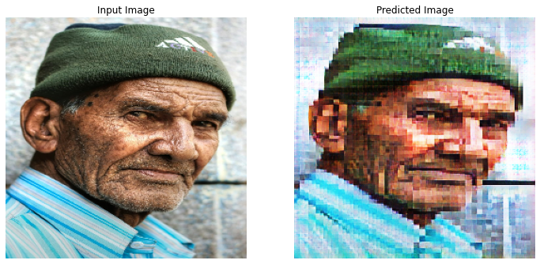
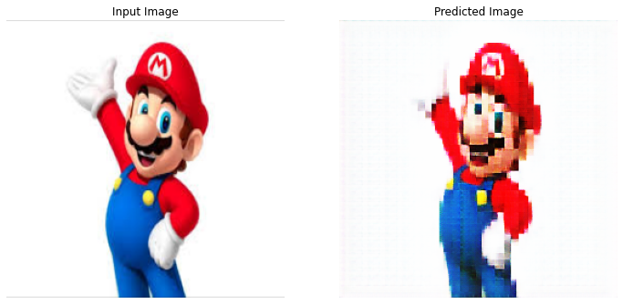
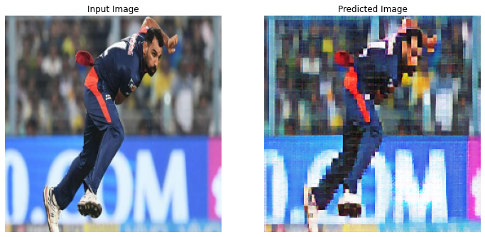
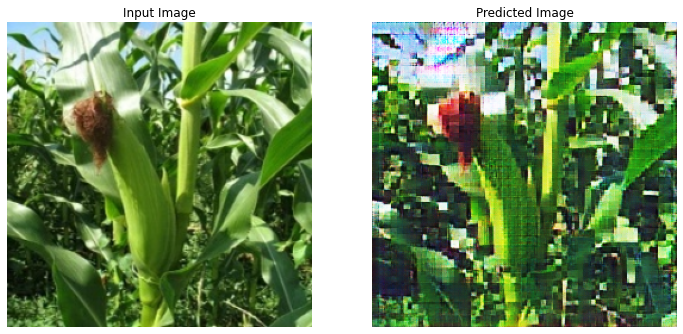
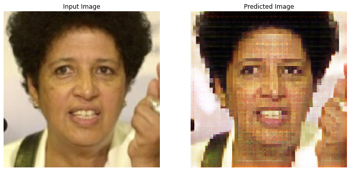
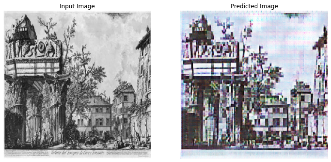
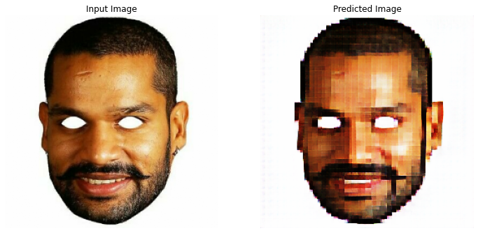
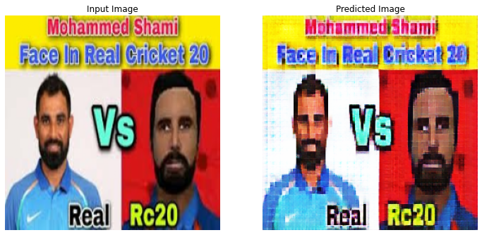
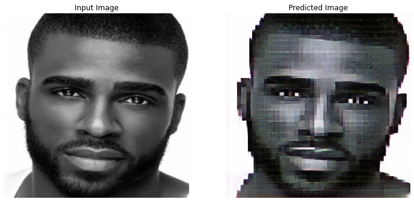
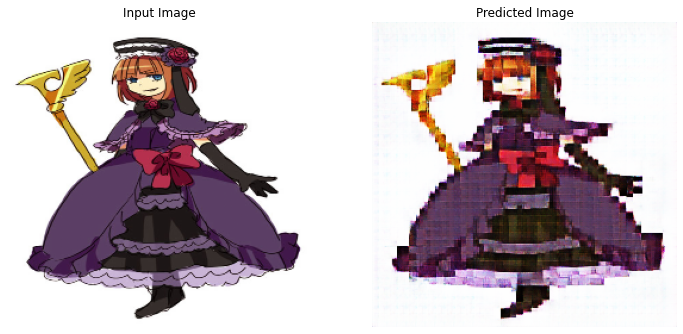
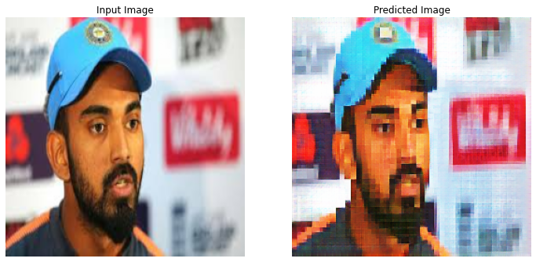
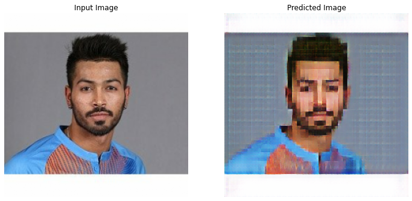
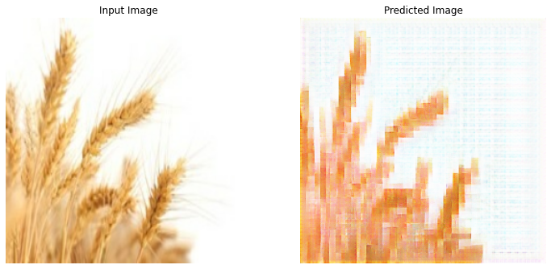
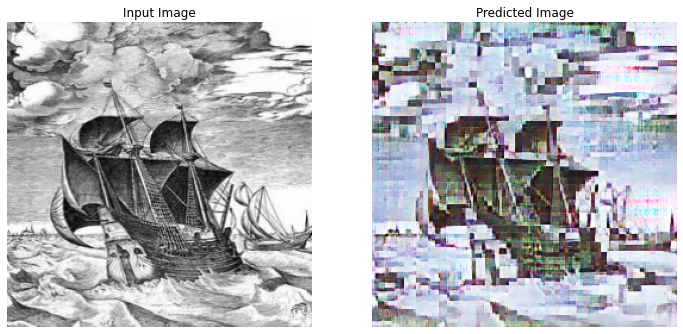
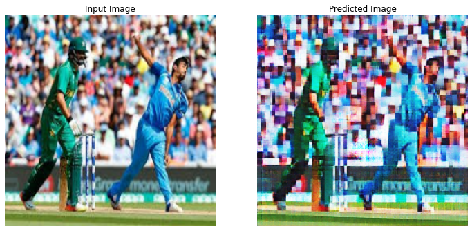
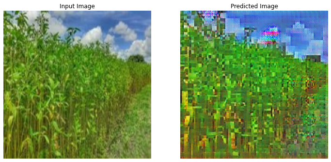
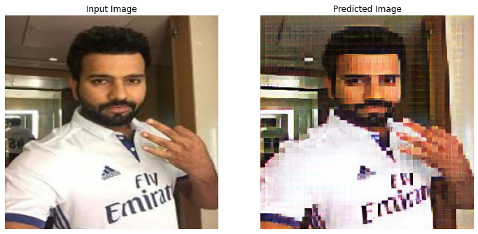
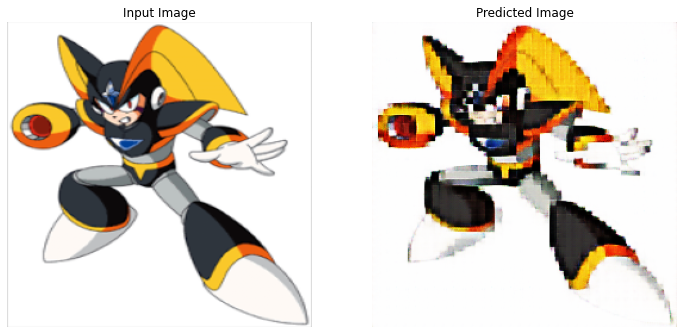

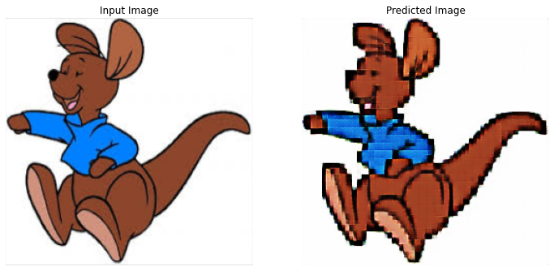
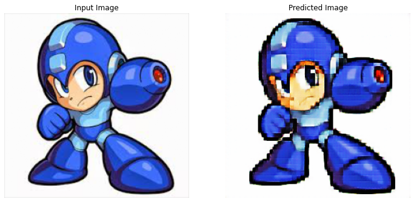
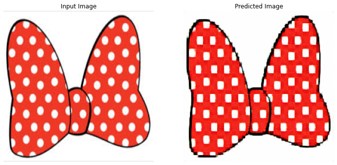
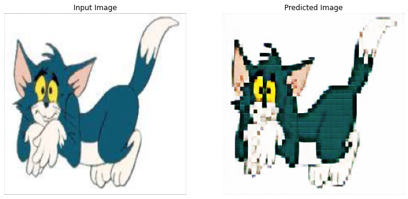
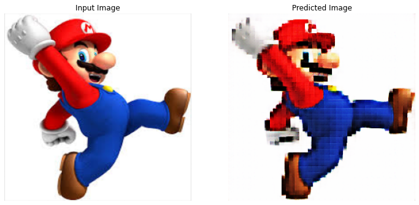
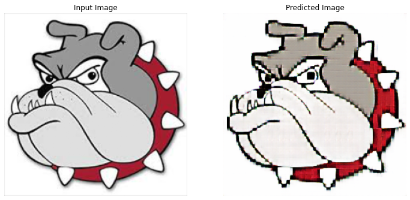
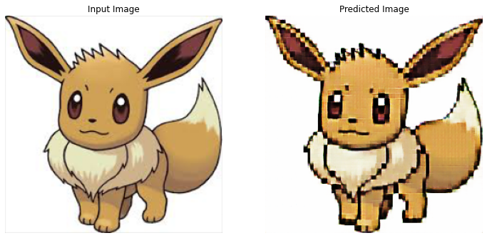
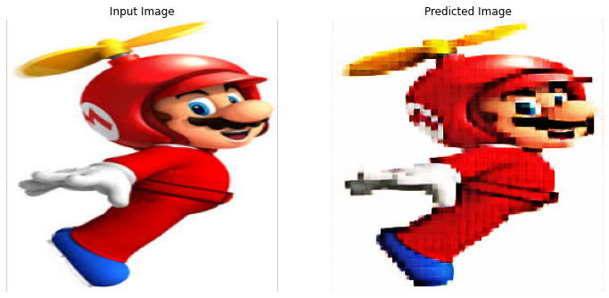
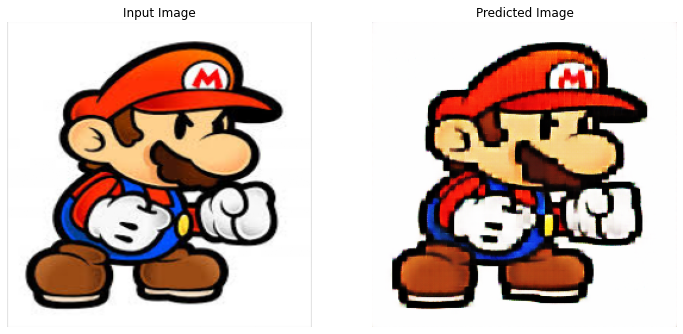
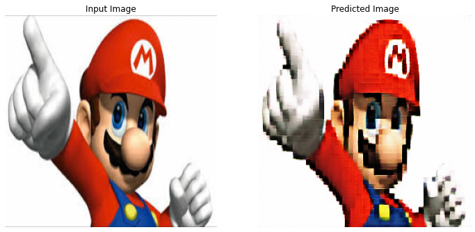
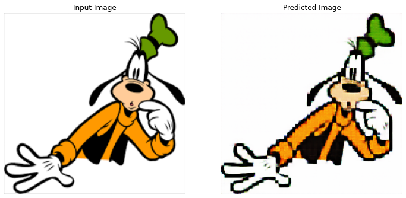
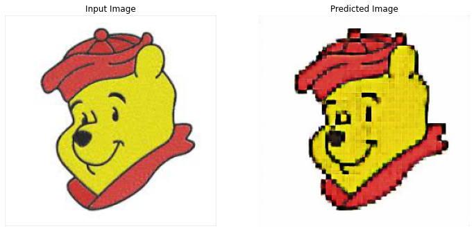
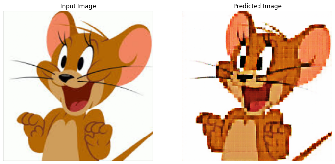
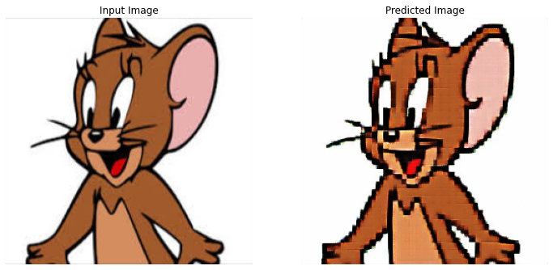
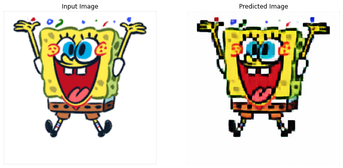

